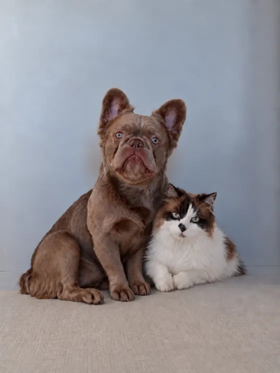

# 😘 Yo, I'm Dmitry Klimchenko aka KTMudak

Веду каналы про нейросети и криптовалюту. Люблю общаться с аудиторией.

Я не профессиональный разработчик. Я простой человек, который каждый день работает с ИИ-агентами: они пишут мне код, я гоняю его в боевых условиях и оставляю то, что реально работает. Всё, что лежит на моём GitHub, я сделал под себя и использую для своих задач - в жизни и в работе.

❤️ А на фотографии мои дети: кот Геннадий и пёс Анатолий.

 

## ⚙️ Чем пользуюсь каждый день

<pre>
🤖 Claude Code    основной инструмент, 97% времени работаю через него
🎨 ChatGPT        генерирую картинки, подключил к своему агенту Hermes
🧠 Gemini         расшифровка голосовых и видео
🧰 Hermes         мой личный секретарь для жизни
💬 Telegram-боты  автоматизировал создание контента для медиа в моём стиле
💻 крипто-боты    помогают мне зарабатывать в крипте деньги на жизнь
</pre>

## ☀️ Где пишу каждый день

- В канале про нейросети: показываю, что создаю
- В канале про крипту: показываю, как зарабатываю
- На Ютюбе: провожу онлайн-воркшопы
- В Инстаграме: просто живу

🇷🇺 Native Russian speaker 🇺🇸 English so so.

## 🎮 Вне терминала

Личной жизни у меня нет: 24/7 я в нейросетях и криптовалюте. Если бы появлялось время, играл бы в компьютерные игры и смотрел фильмы.
